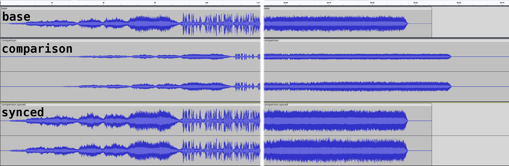

# `synaudio-cli`

A command line tool for aligning and synchronizing two or more audio clips based on their content.

## How it works

* Based on [synaudio](https://eshaz.github.io/synaudio)
* The first file supplied is the `base`. It is used as the basis of comparison.
* The second file supplied is the `comparison`. A copy of this file that is synchronized against the `base` will be saved to disk.
  * These two files supplied should have audio that is similar, but the audio does not need to be an exact match.
    * _The less similar the audio data is, the less likely a successful match will happen._
  * Examples:
    * Two recordings of the same audio taken at different times or with different devices (analog or digital).
    * Two recordings of the same source, but taken with different microphones, or using a slightly different audio mix.
    * Two recordings of the same audio, one synced to a video, and another in a separate audio file that was not synced to the video.
    * Two recordings of an analog tape, one that is synced, but has noise or low fidelity, and another newer recording that is not synced by has higher fidelity.
    * Two digital recordings of the same audio, but the recordings don't match due to clock miss-match and/or clock drift.
* The `comparison` file is decoded into small `comparison sample`s that are taken at regular intervals.
* Each `comparison sample` is then synchronized against the `base` using the [Pearson correlation coefficient](https://en.wikipedia.org/wiki/Pearson_correlation_coefficient) algorithm to determine where each `comparison sample` matches up in the `base` file.
  * See [synaudio](https://eshaz.github.io/synaudio) for details
* The difference between each `comparison sample`'s calculated sample offset and actual sample offset is processed through a linear regression and used to synchronize the `comparison` file against the `base`
  * The `comparison` file is trimmed or padded at the beginning based on the linear regression intercept
  * The `comparison` file is rate adjusted based on the linear regression slope
  * (Optional) The `comparison` file is normalized, either as a whole, or as independent channels.

### Audio Example
The below visual example is a screenshot from an audio editor of the `base`, `comparison`, and final output `synced` files. This example was generated from two recordings from analog tape, one mono low fidelity recording (`base`) and another stereo high fidelity recording (`comparison`). The image is cut in the middle so the beginning and end of the audio are both visible.

```sh
$ synaudio-cli --normalize-independent base.ogg comparison.flac
Decoding files...
Synchronizing files... 100%
Trim start 15.36761384342938 Trim end 3530.78 Rate 0.9999550657881119
Adjusting speed...
Normalizing each channel...
Writing output file...
Done
```


## Installation

### Pre-requisites
* [Node.js](https://nodejs.org/en/download) JavaScript runtime
* [`ffmpeg`](https://ffmpeg.org/) audio processing tool
  * Ensure the `ffmpeg` and `ffprobe` executables are available in your `PATH` environment variable
* [`sox`](https://sourceforge.net/projects/sox/) audio processing tool
  * Ensure the `sox` executable is available in your `PATH` environment variable

### Installing `synaudio-cli`
* From a terminal, run `npm i -g synaudio-cli`

## Usage

### `$ synaudio-cli base.ogg comparison.flac`
* Synchornizes `comparison.flac` to align with `base.ogg`


### `$ synaudio-cli --normalize-independent base.ogg comparison.flac`
* Synchornizes `comparison.flac` to align with `base.ogg`, and normalizes each channel of the output file independently

## Options

```
$ synaudio-cli --help
index.js <base-file> <comparison-file>

syncs the <comparison_file> to the <base_file>

Sync Options:
  -R, --rectify         Rectify the audio before comparing for better cross-correlation  [boolean] [default: true]
  -T, --rate-tolerance  Duration in seconds describing how much +- the rate might differ from the base file.  [number] [default: 0.5]
  -L, --sample-length   Duration in seconds of each comparison file sample.  [number] [default: 0.125]
  -G, --sample-gap      Duration in seconds to skip between samples of the comparison file.  [number] [default: 10]
  -S, --start-range     Duration in seconds to try to sync before the sample.  [number] [default: 180]
  -E, --end-range       Duration in seconds to try to sync after the sample.  [number] [default: 60]

Output Options:
  -d, --delete-comparison      Delete the original comparison file after successfully syncing.  [boolean] [default: false]
  -n, --normalize              Normalize the output audio.  [boolean] [default: false]
  -m, --normalize-independent  Normalize the output audio independently for each channel.  [boolean] [default: false]
  -e, --encode-options         Encode options supplied to `flac`  [string] [default: "--best"]
  -r, --rename-string          String to insert in the synced file before the extension. i.e. comparison.flac -> comparison.synced.flac  [string] [default: ".synced"]

Positionals:
  base-file        File used as the base of comparison.  [string]
  comparison-file  File that will be synced against the base file.  [string]

Options:
      --help     Show help  [boolean]
      --version  Show version number  [boolean]
  -t, --threads  Number of threads to spawn while comparing audio.  [number] [default: 16]
```
